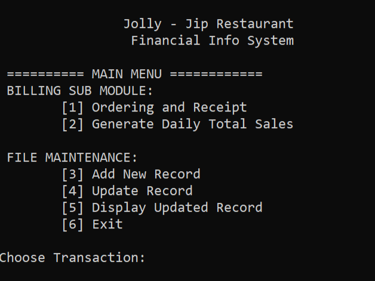
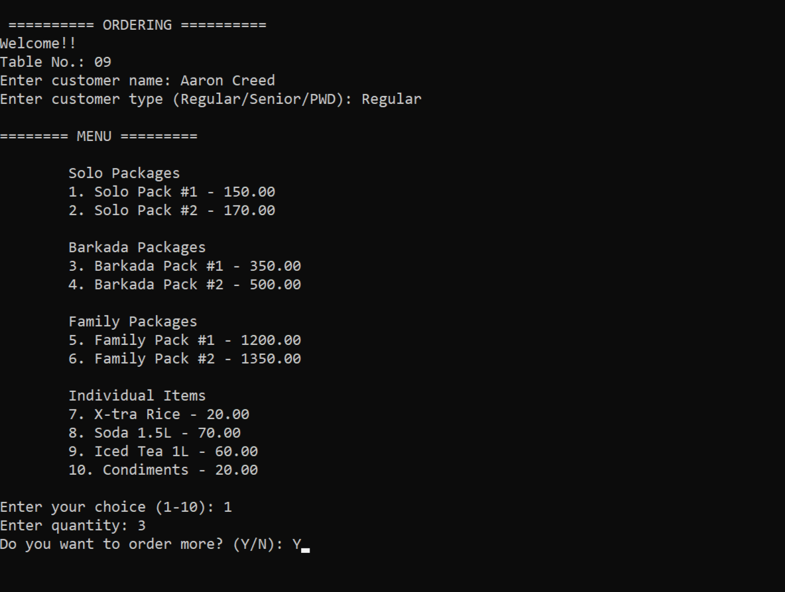
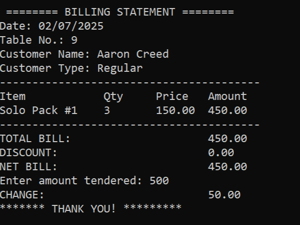
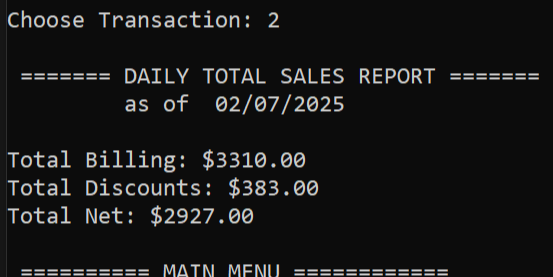
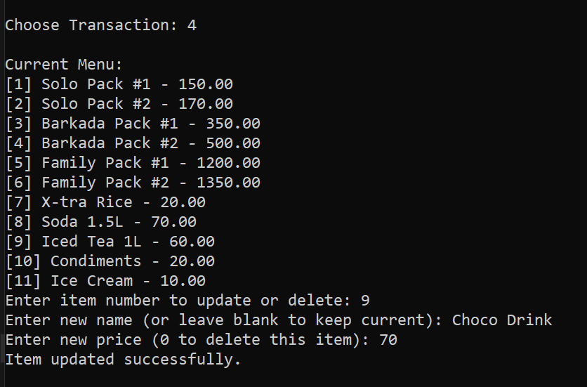
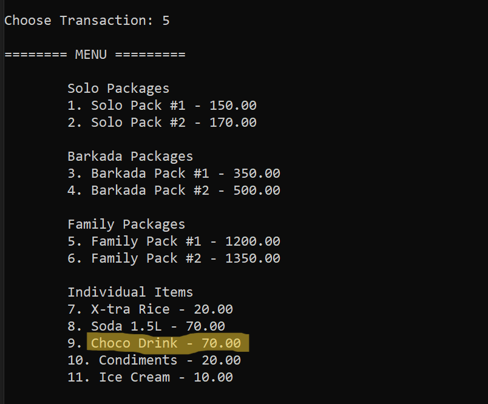

# Jolly-Jip Restaurant Financial Information System

This project is a **C-based financial information system** for a fictional restaurant called *Jolly-Jip*. It was developed collaboratively as a final case study requirement for our **1st Year, 2nd Semester (BSIT)** course at Polytechnic University of the Philippines.

---

### Group Members
- **Aaron Creed P. Celindro** (me)
- Kurt Gemoya
- Sofia Biando

---

### My Contribution
I worked mostly on:
- Creating and organizing the **functions**
- Implementing **file handling** (saving sales data, updating menu)
- Formatting and refining the flow of the program
- **Presented and explained** the whole project to our professor, *Ms. Rosita Canlas*

---

### Project Overview

The system simulates a basic restaurant billing and file maintenance tool. It features:
- Ordering and automated receipt generation
- Discounts based on **customer type** (Regular, Senior, PWD) and **month**
- Daily total sales reporting
- Menu file management (add/update/delete)
- Uses file handling with `menu.txt` and `sales.txt` to persist data

---

### Files Included

- `main.c` – The main source code
- `menu.txt` – The restaurant's menu file (auto-generated if missing)
- `sales.txt` – Log of total, discount, and net sales per transaction
- `README.md` – This file

---

### Sample Screenshots

#### Menu Display

#### Ordering Section

#### Receipt Output

#### Daily Sales Report

#### Add New Record

#### Update Record

#### Display Record

---

### Notes

- Discounts are applied based on customer type and current month (May/June promos).
- This project was written for **learning purposes** and demonstrates:
  - File handling
  - Use of `struct`
  - Menu-driven program flow in C
- **Console-based** (no GUI)

---

### Instructor

**Ms. Rosita Canlas**  
Instructor, BSIT 1-1  
Polytechnic University of the Philippines

